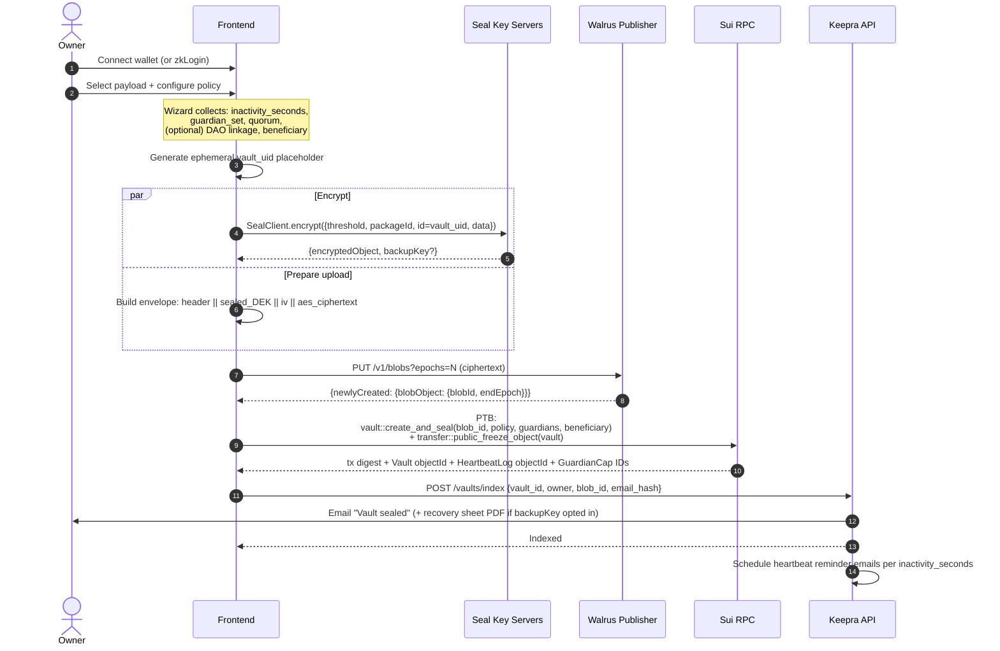
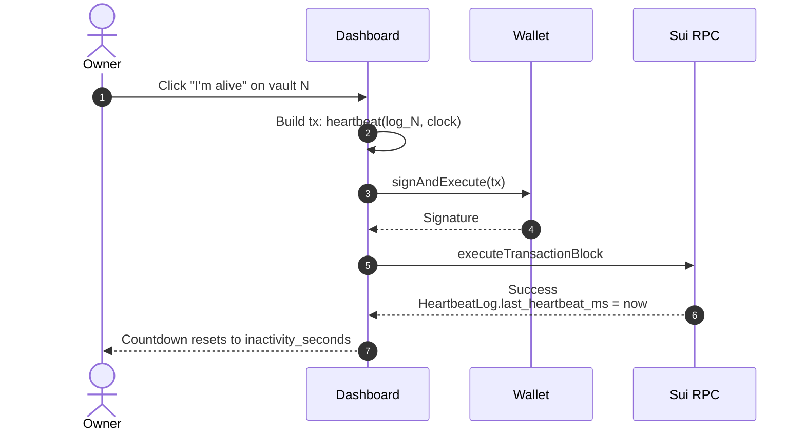
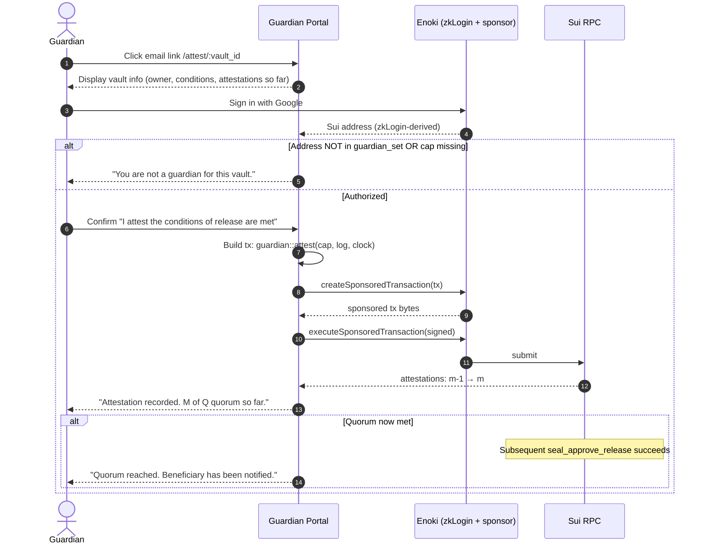
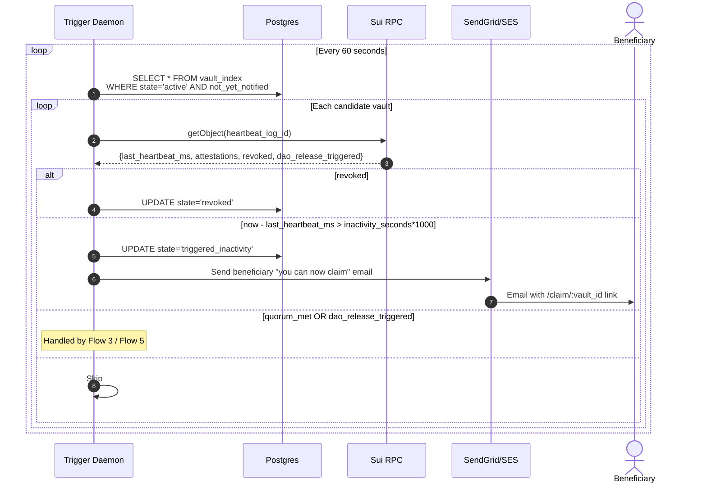
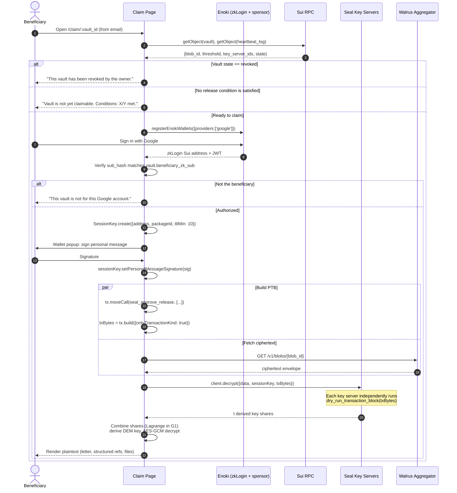
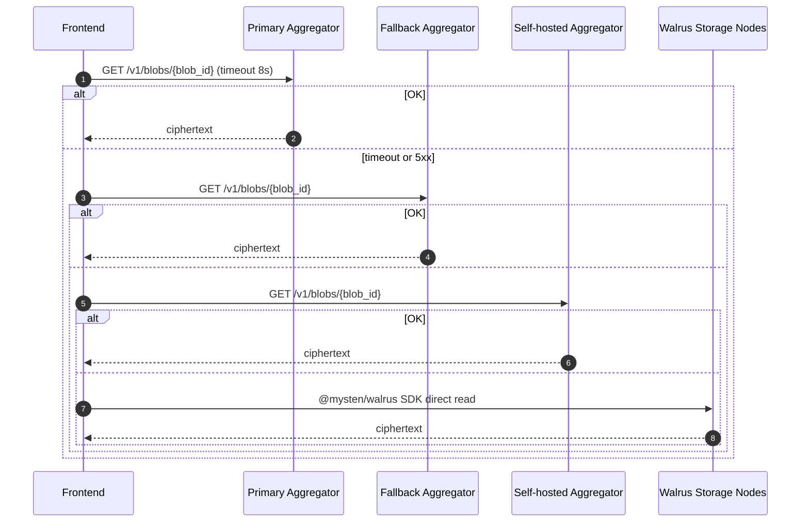
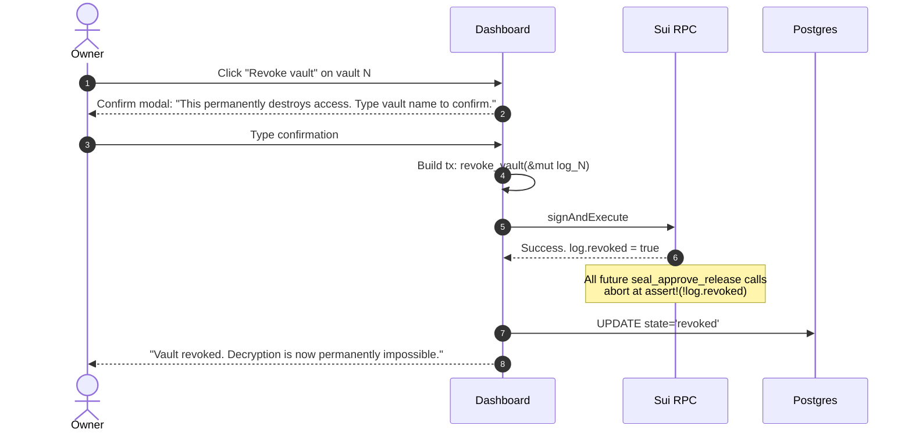
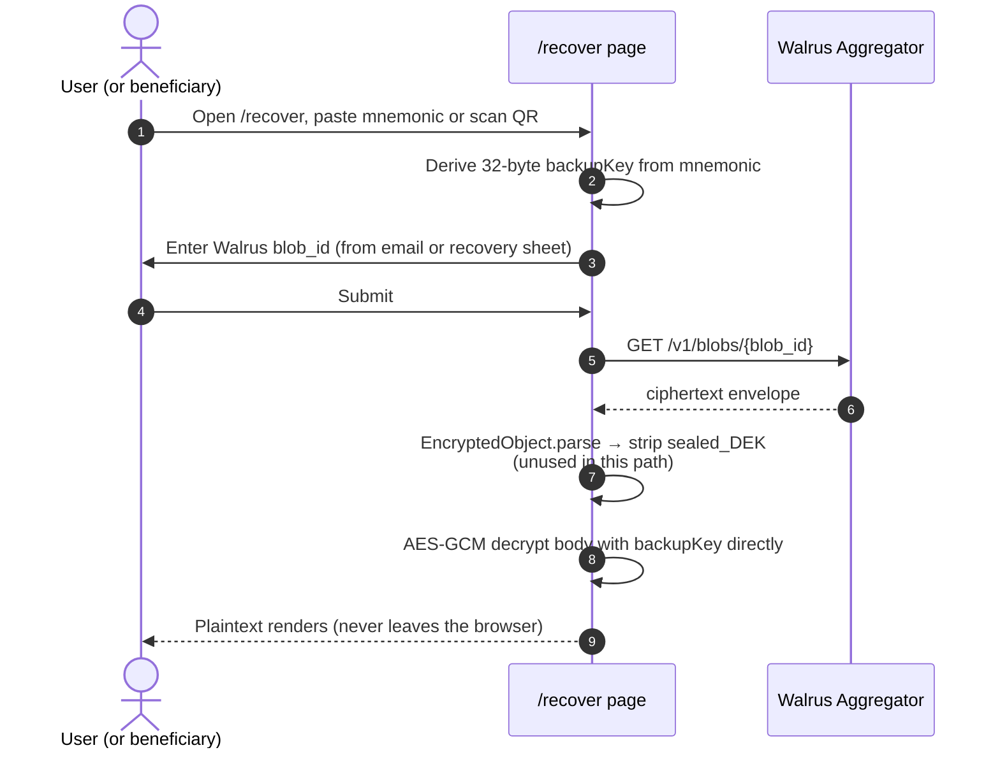

# Keepra — Flows

> **Audience**: anyone implementing or reasoning about a Keepra user journey. Each flow has a sequence diagram (Mermaid, GitHub-native), a step-by-step walkthrough, key error cases, and short pseudo-code where useful.

For the architectural background of each component, see [Architecture.md](./Architecture.md). Move-side definitions in [Contracts.md](./Contracts.md).

---

## Flow Index

1. [Create Vault](#1-create-vault)
2. [Heartbeat (Manual)](#2-heartbeat-manual)
3. [Guardian Attestation](#3-guardian-attestation)
4. [Inactivity Trigger Detection](#4-inactivity-trigger-detection)
5. [DAO Release Flow](#5-dao-release-flow)
6. [Beneficiary Claim](#6-beneficiary-claim)
7. [Seal Decryption Internals](#7-seal-decryption-internals)
8. [Walrus Retrieval](#8-walrus-retrieval)
9. [Revocation](#9-revocation)
10. [Recovery via backupKey](#10-recovery-via-backupkey)

---

## 1. Create Vault

**Goal**: Owner encrypts a payload and seals a `Vault` object on-chain in a single user-facing flow.



### Step-by-step

1. **Connect**. Owner uses a Sui wallet or zkLogin.
2. **Configure**. The wizard collects payload, policy parameters, guardian addresses, beneficiary OAuth subject, optional DAO linkage.
3. **Encrypt** (browser-side). `@mysten/seal` returns the encrypted envelope. If the user opted into the recovery sheet, the SDK also returns `backupKey` — the wizard immediately renders it as a printable QR + mnemonic and discards it from memory.
4. **Upload to Walrus**. The publisher's `PUT /v1/blobs` returns the `blobId`. Keepra prefers an in-house publisher (Phase 11+) but the public publisher works for MVP.
5. **Seal on-chain**. A single PTB:
   - Calls `vault::create_and_seal(...)` minting `Vault`, `HeartbeatLog`, `GuardianCap[]`, and (if linked) `DaoLinkage`.
   - Calls `transfer::public_freeze_object(vault)` to make the Vault immutable.
   - Transfers each `GuardianCap` to the relevant guardian's address.
6. **Index off-chain**. The frontend POSTs to the indexer so the backend can schedule reminders and surface the vault in the owner's dashboard.

### Error cases

| Error | Recovery |
|-------|----------|
| Walrus PUT timeout | Retry against fallback publisher; UI shows progress |
| PTB fails after upload succeeds | UI shows "orphaned blob" warning; offers retry; blob auto-expires if abandoned |
| Seal encryption returns no `backupKey` when user opted in | Block the seal step; user must re-confirm |
| Frozen Vault assertion not satisfied (test) | Compile error or test failure — caught in CI |

### Pseudo-code (frontend, abbreviated)

```ts
// 1. Encrypt
const { encryptedObject, backupKey } = await sealClient.encrypt({
  threshold: 2,
  packageId: KEEPRA_PKG,
  id: deriveVaultId(),         // pre-allocated UID bytes
  data: payloadBytes,
});

// 2. Upload
const { newlyCreated } = await fetch(`${PUBLISHER}/v1/blobs?epochs=${EPOCHS}`, {
  method: "PUT", body: encryptedObject,
}).then(r => r.json());
const blobId = newlyCreated.blobObject.blobId;

// 3. Seal PTB
const tx = new Transaction();
const [vault, log, caps] = tx.moveCall({
  target: `${KEEPRA_PKG}::vault::create_and_seal`,
  arguments: [tx.pure(blobId), /* ... policy args ... */],
});
tx.moveCall({ target: "0x2::transfer::public_freeze_object", arguments: [vault] });
// + transfer guardian caps
await signAndExecute(tx);
```

---

## 2. Heartbeat (Manual)

**Goal**: Owner signals "I'm alive" by submitting a tx that updates `HeartbeatLog.last_heartbeat_ms`.



### Notes

- `heartbeat` is the **only** owner-side recurring action. The user is reminded via email at 7d, 1d, and 1h before expiration (configurable).
- Idempotent at the second level — multiple heartbeats in the same block are no-ops.
- Fails if `log.revoked || log.dao_release_triggered || quorum_already_met`.

### Future: automatic liveness

In v3 (see [Roadmap.md § v3 Automatic Liveness](./Roadmap.md#v3-automatic-liveness)), the indexer treats *any* tx signed by the owner's address as an implicit heartbeat — no manual click needed. The owner can also opt into multi-chain liveness (Ethereum / Solana / Bitcoin) via signed-address proofs.

---

## 3. Guardian Attestation

**Goal**: A guardian formally attests that conditions of release have been met. m-of-n such attestations satisfy the quorum condition.



### Notes

- `attest()` does **not** unlock decryption. It updates an attestation count. The unlock check is live, inside `seal_approve_release`. Even a fully compromised attest path cannot grant unauthorized decryption — at worst, an attacker who steals a `GuardianCap` adds a malicious +1 to the count, which is insufficient unless m-1 other guardians have also been compromised.
- Idempotent on guardian address — re-attest from the same guardian is a no-op.
- Sponsored by Keepra via Enoki (zero gas to guardian).

---

## 4. Inactivity Trigger Detection

**Goal**: When the owner has missed heartbeat for `inactivity_seconds`, beneficiary is notified that they can claim.

> **Critical**: this flow doesn't *unlock* decryption — that's already implicit the moment `clock.timestamp_ms() >= last_heartbeat_ms + inactivity_seconds * 1000`. This flow just *notifies* the beneficiary.



### Implementation notes

- The daemon's only job is **notification**. If the daemon is offline, the beneficiary can still claim manually — they just haven't been pinged.
- The decryption decision is always live; daemon state is purely advisory.
- The daemon also handles **owner reminders**: 7 days, 1 day, and 1 hour before expiration.

---

## 5. DAO Release Flow

**Goal**: When a configured DAO governance proposal passes, the vault becomes claimable.

> **This is Keepra's headline v1 B2B feature.** See [Architecture.md § DAO Release Oracle](./Architecture.md#9-dao-release-oracle).

```mermaid
sequenceDiagram
    autonumber
    actor DM as DAO Members
    participant DAO as DAO Contract (Sui)
    participant Relayer as Oracle Relayer
    participant Keepra as Keepra Move pkg
    participant Mail as Notifier
    actor B as Beneficiary

    Note over DM: Founder is unreachable.<br/>Community starts succession process.
    DM->>DAO: Submit proposal "Invoke succession for Vault X"
    DM->>DAO: Vote (off-chain or on-chain depending on DAO type)
    DAO->>DAO: Tally votes; if threshold met → status=Passed
    DAO-->>Relayer: emit ProposalPassed event

    Relayer->>Relayer: Match proposal topic to DaoLinkage.proposal_topic
    Relayer->>Keepra: dao_oracle::trigger_release(linkage, log, proposal_object)
    Keepra->>Keepra: Verify proposal status, topic, quorum
    Keepra->>Keepra: log.dao_release_triggered = true
    Keepra->>Keepra: emit DaoTriggered event

    Note over Keepra: From this point seal_approve_release passes.
    Keepra-->>Mail: DaoTriggered event observed
    Mail->>B: "Vault X is now claimable"
```

### Critical safety property

The relayer is **untrusted**. Anyone can call `dao_oracle::trigger_release` — the function itself verifies on-chain that:

- The `DaoLinkage`'s package ID and DAO object ID match what was sealed into the vault.
- The supplied proposal object's `topic` field equals `DaoLinkage.proposal_topic`.
- The proposal's status is `Passed`.
- The voting power that approved meets `DaoLinkage.min_quorum`.

If any check fails, the call aborts. A compromised relayer can at worst spam transactions; it cannot trigger a false release.

### DAO compatibility

For MVP we ship one adapter — the **Keepra reference DAO** (also used in the demo). For v1 we ship adapters for popular Sui DAO frameworks. v2+ becomes community-contributed (see [Architecture.md § DAO Compatibility Layer](./Architecture.md#93-the-compatibility-layer)).

### Demo positioning

The visual headline of the Sui Overflow pitch is built around this flow — three browser windows: founder, DAO voters, board claimant.

---

## 6. Beneficiary Claim

**Goal**: A beneficiary signs in with Google, the system verifies they're authorized, the policy allows release, and the plaintext renders in their browser.



### Step-by-step (the user-visible version)

1. Beneficiary opens email, clicks `/claim/:vault_id`.
2. Page shows the vault's status. If not claimable, shows what conditions remain.
3. If claimable, "Sign in with Google" appears. Beneficiary signs in.
4. Page verifies the OAuth subject matches what the owner specified at seal time.
5. Page asks the beneficiary to sign a one-time session-key message (no gas).
6. The decryption happens entirely in the browser — Seal key shares arrive, get combined, the ciphertext is fetched from Walrus, plaintext renders.
7. Beneficiary can download files or copy structured-reference info.

### Error cases

| Error | What the user sees |
|-------|---------------------|
| `Access Denied` from key server | "Authorization failed. The vault state may have changed. Please refresh and try again." |
| `InvalidParameter` | Server's full node hasn't indexed the latest state. Auto-retry with backoff. |
| Threshold not reachable (key servers down) | "Some key servers are temporarily unreachable. Please try again in a moment, or use your backup recovery key if you have one." |
| Walrus aggregator down | Try fallback aggregators in order; surface error only if all fail. |

---

## 7. Seal Decryption Internals

**Goal**: Show exactly what happens cryptographically during a claim.

```mermaid
sequenceDiagram
    autonumber
    participant App as Browser (claim page)
    participant SDK as @mysten/seal
    participant KS1 as Key Server 1
    participant KS2 as Key Server 2
    participant KS3 as Key Server 3
    participant FN1 as Full Node 1
    participant FN2 as Full Node 2
    participant FN3 as Full Node 3

    App->>SDK: decrypt({data, sessionKey, txBytes})
    SDK->>SDK: EncryptedObject.parse(data) → {id, threshold, services[], header}

    par Request key share from each server
        SDK->>KS1: POST /v1/fetch_key {txBytes, session_sig, enc_pub_key}
        KS1->>FN1: dry_run_transaction_block(txBytes)
        FN1-->>KS1: success (seal_approve_release returned ok)
        KS1->>KS1: Derive IBE key for (pkg_id, id, ks1_master)
        KS1-->>SDK: enc(derived_key_1)
    and
        SDK->>KS2: POST /v1/fetch_key
        KS2->>FN2: dry_run_transaction_block
        FN2-->>KS2: success
        KS2-->>SDK: enc(derived_key_2)
    and
        SDK->>KS3: POST /v1/fetch_key
        Note over KS3: server slow / offline
    end

    SDK->>SDK: Have ≥t=2 shares; combine via Lagrange in G1
    SDK->>SDK: Decrypt sealed_DEK with combined IBE key
    SDK->>SDK: AES-GCM decrypt body with DEM key
    SDK-->>App: Plaintext Uint8Array
```

### Why this is secure

- **Each key server independently checks the policy** by dry-running the PTB against its own full node. A single compromised key server cannot fake a policy success because it can only sign with *its own* share — and ≥t shares are required.
- **No key server ever sees plaintext** — the ciphertext is fetched directly by the client from Walrus and decrypted client-side.
- **The session key bounds key-server interaction to 10 minutes**. Even a compromised session signature can only request decryptions for 10 minutes within the package scope.

### PTB constraints (Seal convention)

- Only `seal_approve_*` calls allowed in the PTB.
- All calls must target the same package ID.
- First parameter is the identity (`vector<u8>`) without the package prefix.
- Built with `tx.build({ client, onlyTransactionKind: true })` — never executed, only dry-run.

---

## 8. Walrus Retrieval

**Goal**: Fetch ciphertext from Walrus reliably with fallback paths.



### Notes

- For MVP, public aggregators are sufficient.
- For v1, Keepra operates a self-hosted aggregator behind a CDN for predictable latency.
- For full censorship-resistance demonstration, the SDK can talk directly to storage nodes (slower, more requests, but no single intermediary).

---

## 9. Revocation

**Goal**: While the owner is alive, they can permanently destroy access to a vault. This is the only allowed mutation of a sealed vault.



### Notes

- Revocation is **owner-only** and **irreversible**.
- The Walrus blob is left to expire naturally (not actively deleted). This is intentional — in rare legal scenarios the owner may later want to use their `backupKey` even though they revoked the on-chain release.
- Once revoked, even satisfying every other condition (inactivity, quorum, DAO vote) cannot reopen the vault.

```move
public entry fun revoke_vault(log: &mut HeartbeatLog, ctx: &TxContext) {
    assert!(tx_context::sender(ctx) == log.owner, ENotOwner);
    log.revoked = true;
}
```

---

## 10. Recovery via backupKey

**Goal**: User-side recovery if all chosen Seal key servers permanently fail. Only available if the user opted into the `backupKey` self-custody feature at seal time.



### Notes

- The `backupKey` is the DEM key — it can decrypt the AES-GCM layer directly without ever talking to Seal key servers.
- **Anyone with the backupKey can decrypt.** The recovery sheet must be stored with the same care as a hardware-wallet seed.
- The recovery sheet is rendered as a single printable HTML page at seal time and **immediately discarded from memory**. Keepra never persists it server-side.

---

## Cross-references

- All Move-side definitions for the calls referenced above: [Contracts.md](./Contracts.md)
- UI components for each flow: [Frontend.md](./Frontend.md)
- Services that drive notification, indexing, and oracle relaying: [Backend.md](./Backend.md)
- Threat-model analysis for each flow: [Security.md](./Security.md)
